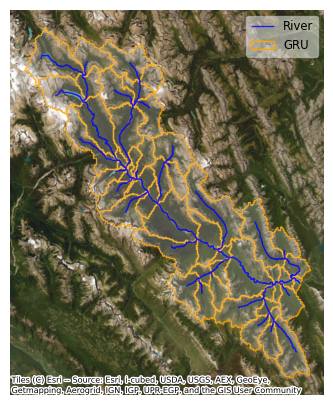

### Introduction to the Bow at Banff Case Study
#### **Basin**
The Bow at Banff basin is located in Alberta, Canada. It has an area of 2216km2 and includes diverse landscapes, including alpine meadows, dense forests, and iconic mountainous terrain. The Bow River is the major watercourse in this basin. Figure below shows the geographical features of the basin. 

#### **Hydrological model**

The hydrological model consists of the [SUMMA](https://www.github.com/CH-Earth/summa) hydrological model (Clark et al., [2015a](https://doi.org/10.1002/2015WR017198), [2015b](https://doi.org/10.1002/2015WR017200)) and [mizuRoute](https://github.com/ESCOMP/mizuRoute) routing model (Mizukami et al., [2016](https://gmd.copernicus.org/articles/9/2223/2016/), [2021](https://doi.org/10.1029/2020MS002434)). The Bow at Banff model is a SUMMA setup of 51 Grouped Response Units (GRUs), these units are not further subdivided, resulting in a total of 51 Hydrologic Response Units (HRUs). MizuRoute post-processes the runoff output from SUMMA and produces streamflow estimates.

#### **Input-Output dataset** 
This dataset comprises 16,489 rows and 14 columns, obtained from our previous model calibration experiment. Each row represents a random sample uniformly drawn from the feasible range of each variable, ensuring comprehensive coverage of the parameter space. The columns contain diverse variable information and are organized as follows: 
- **Sample ID:** Unique identifier for each sample.
- **Multipliers (X, Columns 2-13):** Multipliers serve as scaling factors applied to the default values of model parameters during sensitivity analysis or calibration. Detailed model parameters are outlined in the table below.
- **Negative KGE (Y, Column 14):** The negative Kling-Gupta Efficiency (KGE) metric value associated with each sample. Negative KGE is utilized in our model calibration process.

| Parameter    | Description               | Unit     | Default value | Lower bound | Upper bound |
|--------------|---------------------------|----------|-------------|-------------|-------------|
| k_macropore  | Saturated hydraulic conductivity for macropores | m s−1 | 1.00E-03 | 1.00E-07 | 1.00E-01|
| k_soil       | Hydraulic conductivity of soil | m s−1  | 1.39E-06 | 1.00E-07  | 1.00E-04|
| theta_sat    | Porosity  | -  | 0.399  | 0.3 | 0.6 |
| aquiferBaseflowExp       | Baseflow exponent |  -  | 2 | 1.00E-07 | 10|
| aquiferBaseflowRate      | Baseflow rate when aquifer storage equals aquiferScaleFactor | m s−1 | 1.00E-03 | 1.00E-09  | 1.00E-01     |
| qSurfScale   | Scaling factor in the surface runoff parameterization |  -  | 50 | 1 |  100       |
| summerLAI    | Maximum leaf area index at the peak of the growing season  | m2 m−2  | 3 | 0.1  | 10     |
| frozenPrecipMultip       | Frozen precipitation multiplier  | -  | 1 | 0.5  | 1.5        |
| routingGammaScale        | Shape parameter in Gamma distribution used for sub-grid routing  | s  | 1487.6 | 1  | 5,000,000 |
| routingGammaShape        | Scale parameter in Gamma distribution used for sub-grid routing  | -  | 2.5 | 2  | 3     |
| Fcapil       | Capillary retention as a fraction of the total pore volume  | -  | 0.061 | 0.01  | 0.1      |
| thickness    | Height of the vegetation canopy (Top - Bottom)  | m  | - | 0.0  | 12.9|
